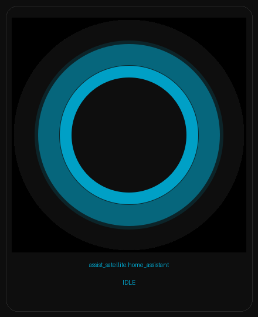
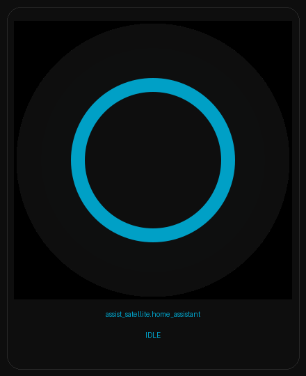
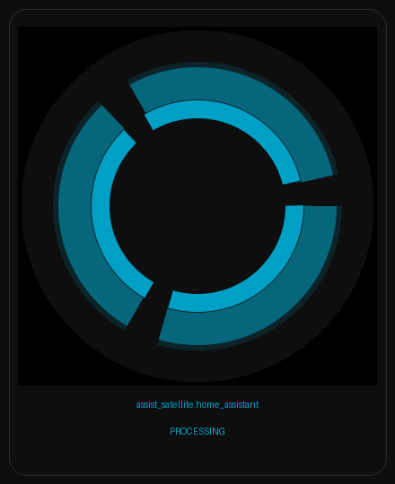

# Cortana Rings for Home Assistant

A custom Home Assistant integration that displays **Cortana-style animated rings** for voice assistant satellites. Brings the iconic Windows 10 / Windows Phone Cortana ring animation to your HA dashboards, complete with authentic sound effects.



## Features

- **Pixel-accurate Cortana ring animation** — reverse-engineered from authentic Cortana reference material
- **Multiple animation states** — idle breathing, listening, processing (orbiting arcs), and responding
- **Cortana sound effects** — plays authentic chimes when the voice assistant starts listening, stops listening, starts thinking, and completes a response
- **Visual card editor** — configure directly from the Lovelace UI, no YAML required
- **Auto-registration** — automatically registers itself as a Lovelace resource
- **Dark theme optimised** — designed for dark HA themes with the authentic Cortana near-black background

## Screenshots

### Card States

| Idle (full ring) | Idle (breathing - bright only) | Processing |
|:---:|:---:|:---:|
|  |  |  |

The ring breathes between the full two-band appearance (bright cyan inner + dark teal outer) and just the bright inner band. A double heartbeat pulse fires periodically.

### Card Configuration


The visual editor lets you select:
- **Satellite Entity** — the `assist_satellite` entity to monitor
- **Media Player** — (optional) a `media_player` entity for Cortana sound effects

## Installation

### Manual Installation

1. Copy the `custom_components/cortana_rings` folder to your Home Assistant `config/custom_components/` directory
2. Restart Home Assistant
3. Go to **Settings → Devices & Services → Add Integration**
4. Search for **Cortana Rings**
5. Select your voice assistant satellite entity and optionally a media player
6. Add the **Cortana Rings** card to any Lovelace dashboard

### HACS (Custom Repository)

1. Open HACS in Home Assistant
2. Go to **Integrations** → click the three dots menu → **Custom repositories**
3. Add this repository URL: `https://github.com/loryanstrant/HA-Cortana-satellite-rings`
4. Category: **Integration**
5. Click **Add**, then install **Cortana Rings**
6. Restart Home Assistant and follow steps 3–6 above

## Configuration

### Via UI (Recommended)

1. Go to **Settings → Devices & Services → Add Integration**
2. Search for **Cortana Rings**
3. Select your `assist_satellite` entity
4. Optionally select a `media_player` for sound effects
5. Add the card to your dashboard:
   - Edit your dashboard → **Add Card** → search for **Cortana Rings**

### Card Configuration

The card can also be added via YAML:

```yaml
type: custom:cortana-rings-card
entity: assist_satellite.your_satellite
media_player: media_player.your_speaker
```

| Option | Type | Required | Description |
|--------|------|----------|-------------|
| `entity` | string | **Yes** | The `assist_satellite` entity to monitor |
| `media_player` | string | No | A `media_player` entity for Cortana sound effects |

## Animation States

| State | Animation | Sound |
|-------|-----------|-------|
| **Idle** | Slow breathing — outer dark band fades in/out, periodic double heartbeat pulse | — |
| **Listening** | Fast breathing (0.9s cycle) | Start listening chime |
| **Processing** | Orbiting arc segments rotating around the ring | Stop listening chime |
| **Responding** | Expanding scale ripple with fade | Thinking chime → completion chime |
| **Unavailable** | Dim static ring (10% opacity) | — |

## Ring Design

The ring consists of two concentric bands, pixel-matched to the authentic Cortana design:

- **Inner bright band** — 9px cyan (#00A0C6)
- **Outer dark band** — 16px teal (#06667C)
- **Background** — near-black (#0E0E0E)

The breathing animation works by fading the outer dark band's opacity, making the ring appear to narrow to just the bright inner band — exactly as in the original.

## Sound Effects

Four Cortana sound effects are included and played through the configured media player:

| Sound | Trigger |
|-------|---------|
| `cortana-listening.wav` | Voice assistant starts listening |
| `cortana-stop-listening.wav` | User finishes speaking |
| `cortana-thinking.wav` | Assistant starts responding |
| `cortana-complete.wav` | Interaction complete |

## Requirements

- Home Assistant 2024.1 or later
- An `assist_satellite` entity (e.g., ESPHome voice assistant satellite)
- (Optional) A `media_player` entity for sound effects

## File Structure

```
custom_components/cortana_rings/
├── __init__.py              # Integration setup, static paths, Lovelace registration
├── config_flow.py           # Config UI flow with entity selectors
├── const.py                 # Constants (domain, paths, version)
├── manifest.json            # Integration metadata
├── strings.json             # UI strings
├── translations/
│   └── en.json              # English translations
└── www/
    ├── cortana-rings-card.js  # Lovelace card (Web Component + SVG)
    └── sounds/
        ├── cortana-listening.wav
        ├── cortana-stop-listening.wav
        ├── cortana-thinking.wav
        └── cortana-complete.wav
```

## License

This project is licensed under the MIT License — see the [LICENSE](LICENSE) file for details.
